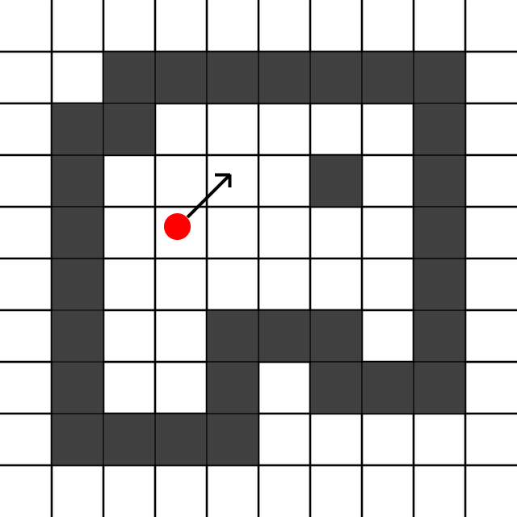
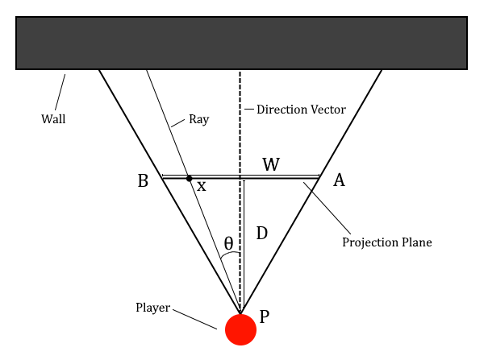
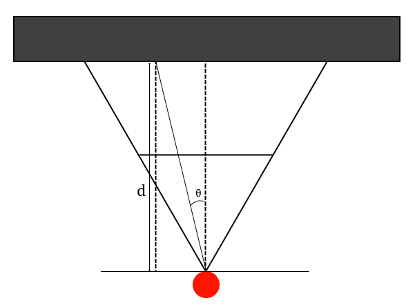
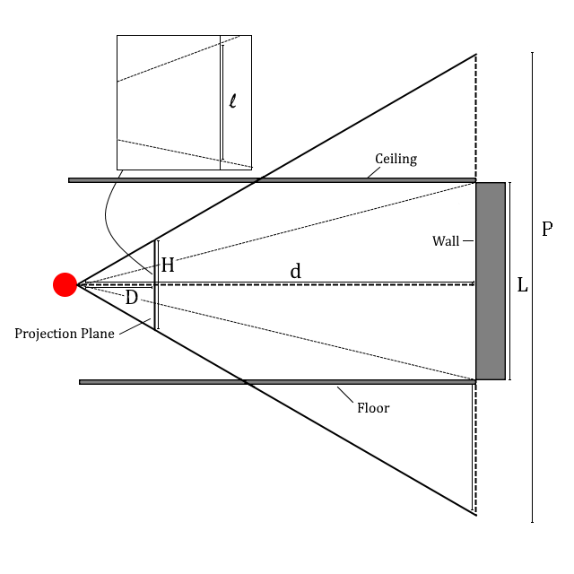

Raycasting Tutorial
===================

The goal of this article is to explain how raycasting works as well as give
pseudocode examples of raycasting in practice. There is a seeming lack of good
resources on this topic; oftentimes being too context-specific or too
language-specific. Furthermore the mathematics are hastily or poorly explained.

Do note that graphical-routines will not be explained; it is assumed that the
read will be familiar with whichever graphical and/or rendering library they
are using.

Some care has been taken to be consistent with the use of notation. Fixed
variables (ha ha) are given in uppercase while variable variables are given
in lower case. 

Table of Contents
-----------------
1. [Overview](#Overview)
2. [The Projection Plane](##the-projection-plane)
3. [Sweeping the Ray](## Sweeping the Ray)
4. [Casting the Ray](##Overview)
5. [Calculating Projected Height of Walls](##Overview)
6. [Drawing to the Screen](#)
7. [Putting it all Together](#)
8. [Textures](#)

Overview
--------

The goal of raycasting is to turn a 2D level consisting of floors and walls
into a 3D representation of it by calculating z-information based on distance.
To keep things simple we shall use a boolean array to represent the level. Thus
the expression level[x][y] will evaluate to true if there is a wall at (x,y)
and false otherwise.

In addition to the level there is also a player. The player has a position
which is a floating-point vector and so we will have to do some rounding
later on when indexing the level array. The player also has a direction vector
which points in the direction the player is facing.

   

A very basic overview of the raycasting algorithm is given below. Do not worry
if some terms are unfamiliar to you, these will be exaplained in detail in the
section they are relevant in.

1. Start at the left-edge of the projection plane.
2. Determine at which angle to cast the ray at.
3. Cast out a ray originating from the player. This returns the distance to
       the first wall it collides with.
4. Calculate the projected height of the wall based on this distance.
5. Draw a vertical strip on the screen based on this apparent height. This
   involved orthonogally projecting the projection plane onto the screen,
   possibly stretching the projection plane to fit in the process.
6. Move onto the next strip of the projection plane. If there is no more
       strips left we are done. Otherwise go back to step 2.

The Projection Plane
--------------------

The projection plane is an imaginary plane sitting perpendicular to the
player's direction vector at some distance from the player. How wide things
appear are determined by two things: the distance from the player to the 
projection plane D and the width W of the projection plane. Both D and W are
constants fixed at the start of the program. Together they
determine the so-called horizontal FOV (field of view). The horizontal FOV is the angle 
BPA in the diagram below. Because W and D are fixed one may easily convert 
back and forth between horizontal FOV and W and D.

FIG2

The reason for preferring to deal in terms of the width (and later height) of the 
projection plane will become apparent as we go along. 

Sweeping the Ray
----------------

For each frame we must sweep the ray in front on the player to draw the level.
The naive approach would simply be to start the ray as PB in Fig. 2 and increment the
angle of the ray by a fixed amount until the ray is equal to PA. This method 
results in a distorted view since the projection plane is orthogonally projected 
onto the screen and fixed-angle increments sweeps out a circular section. 
The effect is that the world will look *as if the projection 
plane was curved* and our "camera" was using a curved or circular lens.
This is often-times referred to as the "fish-eye effect".

Instead, we must calculate the angle based on how far along the projection
plane we are drawing. Consider again Fig 2. We have set our zero to be the position straight ahead of the
player. We get \theta = atan(x/D) and as we expect \theta will then
range from -pi/2 to pi/2. Of course we rarely actually want a horizontal FOV of 180^deg
so by varying the distance to the projection plane D we can get any horizontal FOV we
want. As an example, with a width of W = 480 and a distance D = 240 the angle
\theta will go from -45 deg to 45 deg; an horizontal FOV of 90 degrees. 

The actual angle the ray is cast at is then atan(x/D) plus whatever the angle
of the player's direction vector is. The pseudocode looks like this:

    BEGIN
        FOR x=-W/2 TO W/2
            angle = atan(x/D) + player_direction_vector_angle
            d = CAST RAY AT angle
            ...
        ENDFOR
    END

where the "..." stands for calculating the projected height, drawing to the
screen, etc. In the following sections we will expand this "..." and eventually
end up with a full pseudocode for raycasting. The very first step is to delve
into the "CAST RAY AT" method which will return the distance to the closest
wall when given an angle.

Casting the Ray
---------------
There are a multitude of algorithms for determining whether a casted ray will
collide with a wall, and if so, what the distance between the origin of the
ray and the wall is. The one explained in this article is the most simple. 
We begin at the player position (x0, y0) and then increment by (dx, dy) in 
a loop until we collide with a wall. Let us fix some small size to increment 
the ray by, say h. Basic trigonometry then tells us

dx = h * cos(theta),
dy = h * sin(theta),

where theta is the angle determined from the previous section. To check for
collisions we simply refer to the 2D array of booleans which tells us where 
the walls of the level are. One benefit of this method is that we get the
length of the ray for free. We simply calculate the Euclidean distance
between the points (x0, y0) and (x,y) where (x,y) is the point we collided
with the wall at. The pseudocode looks like this:

    FUNCTION CAST_RAY(angle)
        x = x0
        y = y0

        LOOP
            x += h * cos(angle)
            y += h * sin(angle)            
            IF walls[x][y] THEN
                RETURN cos(angle) * sqrt((x-x0)^2 + (y-y0)^2)
    ENDFUNCTION

The loop gets broken by the return call ensuring we don't get stuck iterating
forever. The multiplication of the length of the ray by cos(theta) 
begs an explanation. Because the projection plane is orthogonally projected onto the
screen, the distance from the screen to the wall is not the length of
the ray, but rather that of the component of the ray 
*perpendicular* to the projection plane. As seen in the diagram below, we need 
to multiply the length of the ray by cos(theta) to get the length of the perpendiuclar 
component.

FIG3

From now on when speaking of the distance d to the wall we shall always mean the
perpendiuclar distance and distinguish it from the Euclidean distance by
instead referring to that as the length of the ray.

Calculating Projected Height of Walls
-------------------------------------

To calculate the apparent or projected height of the
wall we must decide on how tall our projection plane is, which we note by H. 
Just as in the case with the horizontal FOV the distance to and height of the projection plane determines
our vertical FOV.

FIG4

The figure shows three triangles lying on their sides from top to bottom,
corresponding to the projections of the ceiling, wall, and floor, respectively.
The wall will have an apparent height of l as the entire view of height P 
gets shrunk to fit in the projection plane of height H. We also see that
the the rest of the projection plane's height are taken up the ceiling
and floor in equal proportions.

One issue which has not been a problem until now is what happens if the wall is closer
to the player than the projection plane is. Our calculations up
til now didn't need to account for this since the angle of the ray does not depend on where the
wall is, and while the distance to the wall of course depends on where the
wall is, it does not depend on how far away the projection plane is. The
apparent height of the wall does however depend on both the distance to
the projection plane as well as the distance to the wall. The diagram
below gives a side-view which demonstrates this.

For now assume the wall is at least as far away from the player as the
projection plane is. 
Using Fig 4. we see that by similar triangles

H/D = P/d
L/P = l/H

which yields

l = LD/d

It might surprise you that the height of the projection plane 
has no impact on the
apparent height of the wall. Instead, a larger projection plane height and
thus vertical FOV results in the
apparent height of the wall being a smaller *percentage* of the entire screen, as that
is given by l/H. Importantly, assuming our player has his eyes in the middle
of the room, i.e. the ray originates at a height of L/2, we find that the
top (H - l)/2 of the screen should be drawn as ceiling, and the bottom
(H - l)/2 as floor, with the middle l as wall.

What happens then if the wall is closer to us than the projection plane is?
Clearly it must fill up the entire projection plane, and as a result the entire
screen once the plane is projected onto the screen. Thus, we may simply report
an apparent height of H whenever the distance to the wall is smaller than that
of the distance to the projection plane. Things become slightly more complicated
when textures are considered, but that will be covered in a later section. 

The pseudocode of this section is very simple:

    IF d > D THEN
        l = LD/d
    ELSE
        l = H
    ENDIF

Drawing to the Screen
---------------------

The screen (more properly: main window) may very well be running in a different
resolution as to that of the projection plane. Thus unless the width and height
of the projection plane exactly match the resolution of the main window we must
perform some scaling before orthogonally projecting the result.

Vertically this is very simple. We start at the top of the screen and draw
ceiling for (H - l)/2 * (SCRHEIGHT / H), then wall for l * (SCRHEIGHT / H)
and finally floor for (H - l)/2 * (SCRHEIGHT / H).  To stretch horizontally 
we simply make sure each vertical strip we draw as described above has 
width SCRWIDTH / W.

Our drawing function looks like:

    FUNCTION DRAW_STRIP(l, x)
        FOR y=0 to y=(H-l)/2
            FOR w=x TO w=x+SCRWIDTH / W
                DRAW PIXEL at (x,y)
            ENDFOR
        ENDFOR

        FOR y=(H-l)/2 to y=(H-l)/2 + l
            FOR w=x TO w=x+SCRWIDTH / W
                DRAW PIXEL at (x,y)
            ENDFOR
        ENDFOR

        FOR y=(H-l)/2 + l to y=SCRHEIGHT
            FOR w=x TO w=x+SCRWIDTH / W
                DRAW PIXEL at (x,y)
            ENDFOR
        ENDFOR
    ENDFUNC

Putting it all Together
-----------------------

We can now put all the parts together. We have the main loop that goes through
the width of the projection plane, calculates the angle, casts a ray at that
angle to get the distance to the closest wall, calculates the projected height
of the wall, and finally projects it to the screen and draws it. This matches
exactly the steps described at the very start of the article.

    BEGIN
        FOR x=-W/2 TO W/2
            angle = atan(x/D)
            distance = CAST_RAY(angle)

            IF distance > D THEN
                l = LD/d
            ELSE
                l = H
            ENDIF

            DRAW_STRIP(l, x)
        ENDFOR
    END

    FUNCTION CAST_RAY(angle)
        x = x0
        y = y0

        LOOP
            x += h * cos(theta)
            y += h * sin(theta)            
            IF walls[x][y] THEN
                RETURN cos(theta) * sqrt((x-x0)^2 + (y-y0)^2)
    ENDFUNCTION

    FUNCTION DRAW_STRIP(l, x)
        FOR y=0 to y=(H-l)/2
            FOR w=x TO w=x+SCRWIDTH / W
                DRAW PIXEL at (x,y)
            ENDFOR
        ENDFOR

        FOR y=(H-l)/2 to y=(H-l)/2 + l
            FOR w=x TO w=x+SCRWIDTH / W
                DRAW PIXEL at (x,y)
            ENDFOR
        ENDFOR

        FOR y=(H-l)/2 + l to y=SCRHEIGHT
            FOR w=x TO w=x+SCRWIDTH / W
                DRAW PIXEL at (x,y)
            ENDFOR
        ENDFOR
    ENDFUNC

Textures
--------

TBA
